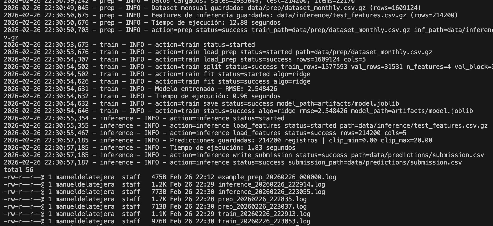

# Sales Predictions — Production-ready ML Pipeline

Este repositorio implementa un pipeline end-to-end (prep → train → inference) para el reto de Kaggle **Predict Future Sales**. El modelo predice las ventas mensuales por `(shop_id, item_id)` y genera un archivo `submission.csv` listo para subir a Kaggle.

La meta de la **Tarea 03** es convertir un proyecto que ya corre a un estándar **production-ready**: estructura limpia, funciones reusables, docstrings, logging, y herramientas automáticas de calidad (Ruff + Pylint).

## Estructura del repositorio

```text
.
├── artifacts/
│   └── logs/                 # logs timestamped (se generan al correr scripts)
├── data/
│   ├── raw/                  # datos originales de Kaggle
│   ├── prep/                 # dataset mensual para entrenamiento (generado)
│   ├── inference/            # features del set de test (generado)
│   └── predictions/          # submissions (generado)
├── notebooks/                # exploración y prototipos
├── scripts/                  # entrypoints CLI
└── src/
    └── sales_predictions/
        ├── utils/            # utilidades (logging, validation, metrics)
        ├── prep.py           # ETL / features
        ├── train.py          # entrenamiento
        └── inference.py      # submission
```

## Instalación y setup

Se recomienda `uv`.

```bash
uv venv
source .venv/bin/activate
uv sync --extra dev
```

## Ejecución del pipeline

```bash
python scripts/prep.py
python scripts/train.py
python scripts/inference.py
```

Los logs se guardan en `artifacts/logs/` y también se imprimen en consola.



## Entradas y salidas

- `scripts/prep.py`
  - **Input:** `data/raw/sales_train.csv`, `data/raw/test.csv`, `data/raw/items_en.csv`
  - **Output:** `data/prep/dataset_monthly.csv.gz`, `data/inference/test_features.csv.gz`

- `scripts/train.py`
  - **Input:** `data/prep/dataset_monthly.csv.gz`
  - **Output:** `artifacts/model.joblib`

- `scripts/inference.py`
  - **Input:** `data/inference/test_features.csv.gz`, `artifacts/model.joblib`
  - **Output:** `data/predictions/submission.csv`

## Métricas del modelo

- **RMSE (validación):** RMSE: 2.548426
- **Kaggle Leaderboard:** https://kaggle.com/competitions/competitive-data-science-predict-future-sales

## Calidad de Código

### Ruff (format)

```bash
ruff format src scripts
```

### Pylint

```bash
pylint src/sales_predictions
```
## Calidad de Código


