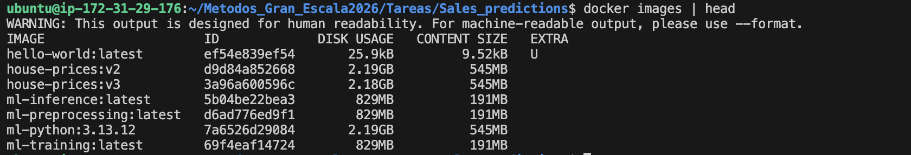
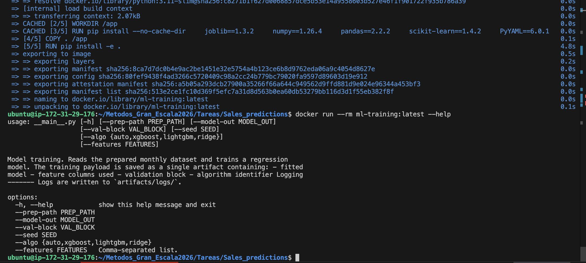
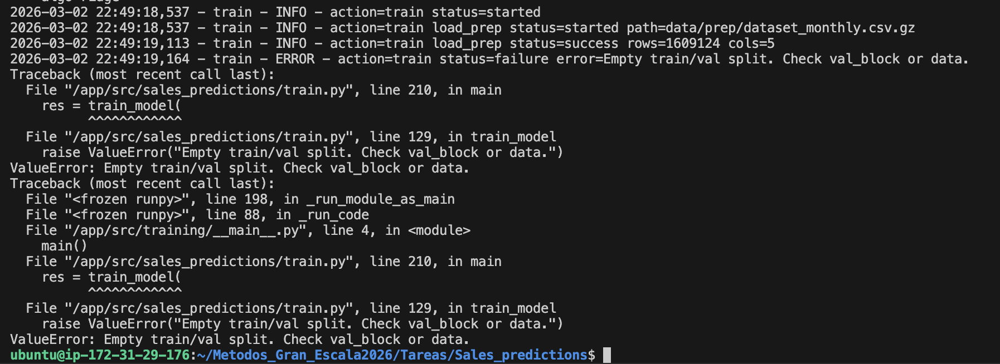
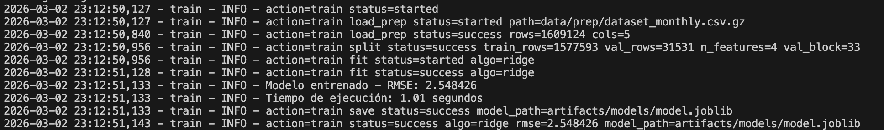
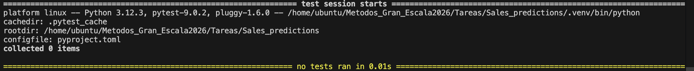
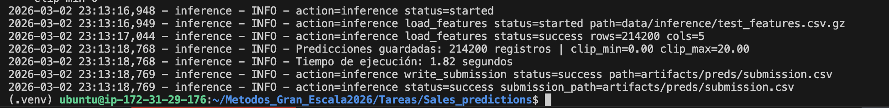
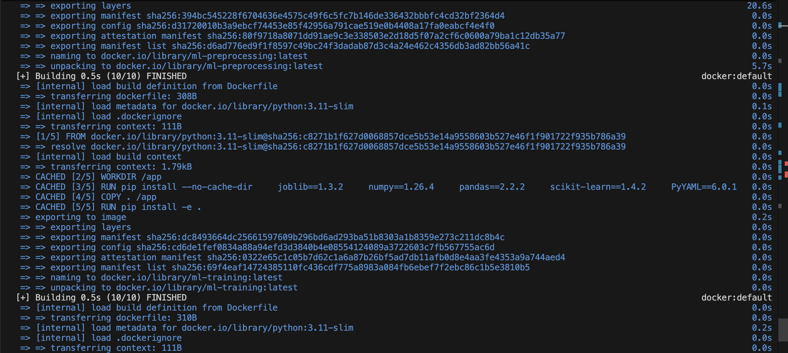
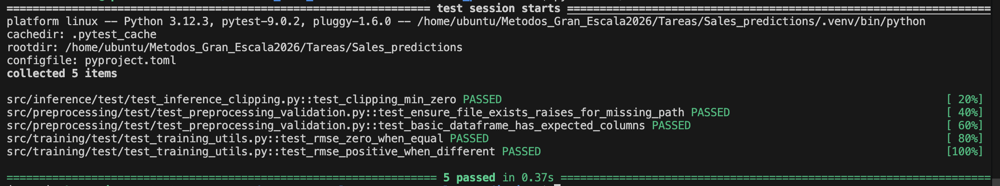

# Sales Predictions – MLOps Pipeline

## 📌 Descripción

Este proyecto implementa un pipeline completo de Machine Learning para el dataset Kaggle – Predict Future Sales, siguiendo buenas prácticas de MLOps:

- Steps desacoplados (preprocessing, training, inference)
- Contenedores Docker independientes
- Ejecución reproducible en EC2
- CLI arguments parametrizables
- Logging estructurado
- Pruebas unitarias con pytest
- Workflow Git con feature branches + development + main

---

# Estructura del Proyecto

```text
Tareas/Sales_predictions/
├── README.md
├── pyproject.toml
├── uv.lock
├── data/
│   ├── raw/                 # Kaggle CSVs (no subir a Git si son pesados)
│   ├── prep/                # dataset_monthly.csv.gz
│   └── inference/           # test_features.csv.gz
├── artifacts/
│   ├── logs/                # logs del pipeline
│   ├── models/              # model.joblib
│   └── preds/               # submission.csv
├── docs/
│   └── screenshots/         # evidencia EC2 (docker build/run + pytest)
└── src/
    ├── preprocessing/
    │   ├── Dockerfile
    │   ├── __init__.py
    │   ├── __main__.py      # ENTRYPOINT: python -m preprocessing
    │   └── test/
    │       └── test_preprocessing_validation.py
    ├── training/
    │   ├── Dockerfile
    │   ├── __init__.py
    │   ├── __main__.py      # ENTRYPOINT: python -m training
    │   └── test/
    │       └── test_training_utils.py
    ├── inference/
    │   ├── Dockerfile
    │   ├── __init__.py
    │   ├── __main__.py      # ENTRYPOINT: python -m inference
    │   └── test/
    │       └── test_inference_clipping.py
    └── sales_predictions/
        ├── prep.py
        ├── train.py
        ├── inference.py
        └── utils/
            ├── data_validation.py
            ├── logging.py
            └── metrics.py

---

# Git Workflow

Se utilizó el siguiente flujo:

- main → rama productiva
- development → integración
- feature/mlops-docker-steps → desarrollo de dockerización

PR realizados:

1. feature → development  
2. development → main  

---

# Docker Build (EC2)

## Build de imágenes

docker build -t ml-preprocessing:latest ./src/preprocessing
docker build -t ml-training:latest ./src/training
docker build -t ml-inference:latest ./src/inference

### Evidencia




---

# Ejecución del Pipeline

## 1 Preprocessing

docker run --rm   -v $(pwd)/data:/app/data   -v $(pwd)/artifacts:/app/artifacts   ml-preprocessing:latest   --raw-dir data/raw   --prep-dir data/prep   --inference-dir data/inference   --prep-name dataset_monthly.csv.gz   --inference-name test_features.csv.gz

---

## 2 Training

docker run --rm   -v $(pwd)/data:/app/data   -v $(pwd)/artifacts:/app/artifacts   ml-training:latest   --prep-path data/prep/dataset_monthly.csv.gz   --model-out artifacts/models/model.joblib   --val-block 33   --seed 42   --algo ridge

### Evidencia Training




---

## 3 Inference

docker run --rm   -v $(pwd)/data:/app/data   -v $(pwd)/artifacts:/app/artifacts   ml-inference:latest   --inference-path data/inference/test_features.csv.gz   --model-path artifacts/models/model.joblib   --pred-out artifacts/preds/submission.csv   --clip-min 0   --clip-max 20

### Evidencia Inference





---

# Pruebas Unitarias

Ejecutar:

pytest src/ -v

### Evidencia



---

# Mejora Implementada

Se agregó postprocesamiento configurable mediante CLI:

--clip-min  
--clip-max  

Esto evita:

- Predicciones negativas  
- Valores extremos no realistas  

---

# Autor

Manuel De la Tejera  
ITAM – Maestría en Ciencia de Datos  
Arquitectura de Datos 2026
