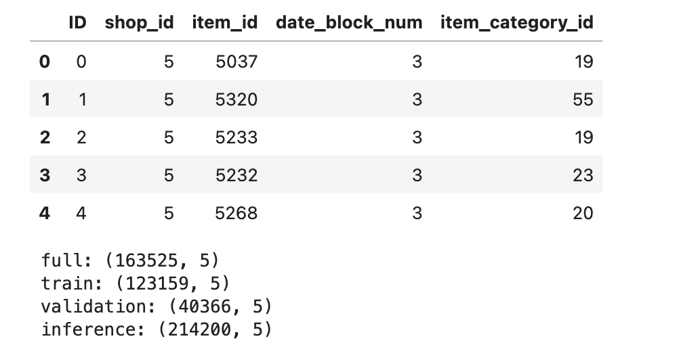
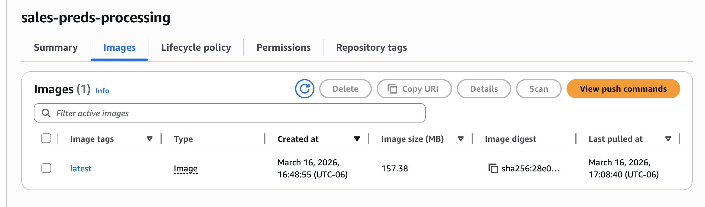
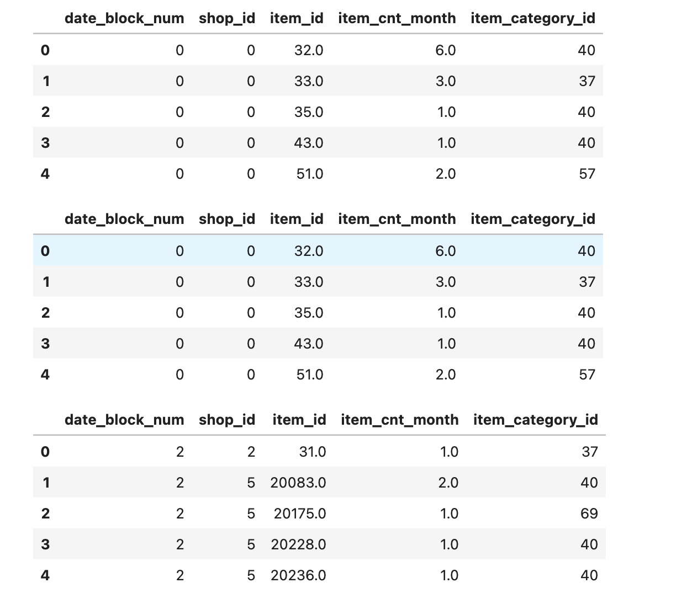
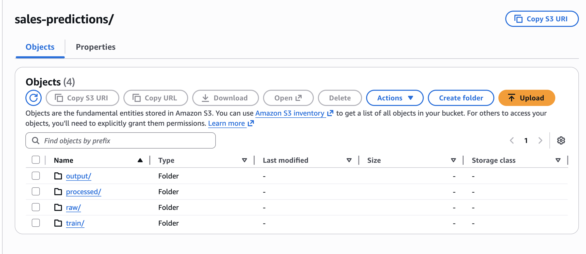

# SageMaker Processing Job --- BYOC (Feature Engineering Pipeline)

<<<<<<< HEAD
---

# Model

The model implemented is a **Ridge Regression model** trained on monthly aggregated sales data.

Training output example:

```
Modelo entrenado - RMSE: 2.548426
```
=======
## Overview

This project implements a **data preprocessing pipeline in Amazon
SageMaker using a Bring Your Own Container (BYOC)** architecture.

The objective of this stage is to transform **raw sales data into
structured feature datasets** that can later be used for machine
learning training and inference.

Instead of preprocessing data locally, the pipeline runs inside a
**SageMaker Processing Job**, ensuring:

-   reproducibility
-   scalability
-   cloud‑native execution
-   separation between compute and storage

------------------------------------------------------------------------

# Pipeline Architecture
>>>>>>> feature/sagemaker-processing-byoc

S3 Raw Data\
↓\
SageMaker Processing Job (BYOC container)\
↓\
Feature Engineering (`processing/preprocess.py`)\
↓\
Processed datasets stored in S3\
↓\
Training / Inference pipeline

<<<<<<< HEAD
# Docker Containers

Two Docker images were built for SageMaker:

### Training Image

Responsible for running model training.

```
Dockerfile.train
ENTRYPOINT: train_sagemaker.py
```

### Inference Image

Responsible for serving predictions through a SageMaker endpoint.

```
Dockerfile.infer
ENTRYPOINT: sagemaker_inference
```
=======
------------------------------------------------------------------------

# Container Architecture (BYOC)

A custom Docker container was built for preprocessing.

The container includes:

-   Python
-   pandas
-   numpy
-   project source code
>>>>>>> feature/sagemaker-processing-byoc

The container executes:

<<<<<<< HEAD
# Build Docker Images

```
docker build --network sagemaker -f sagemaker/Dockerfile.train -t sales-preds-train .
docker build --network sagemaker -f sagemaker/Dockerfile.infer -t sales-preds-infer .
```
=======
    processing/preprocess.py

The image is stored in **Amazon ECR**.

------------------------------------------------------------------------

# Processing Job Execution

The preprocessing job runs using the **SageMaker ScriptProcessor API**.
>>>>>>> feature/sagemaker-processing-byoc

Input data is mounted inside the container at:

<<<<<<< HEAD
# Push Images to AWS ECR

Repositories created:

```
sales-preds-train
sales-preds-infer
```

Images pushed to:

```
448591726855.dkr.ecr.us-east-1.amazonaws.com/sales-preds-train
448591726855.dkr.ecr.us-east-1.amazonaws.com/sales-preds-infer
```
=======
    /opt/ml/processing/input

Outputs are written to:

    /opt/ml/processing/output
>>>>>>> feature/sagemaker-processing-byoc

------------------------------------------------------------------------

<<<<<<< HEAD
# SageMaker Training Job

The training job was executed in SageMaker using the custom training container.

Training process:

1. Load dataset
2. Train Ridge regression
3. Evaluate RMSE
4. Save model artifact

Example log output:

```
action=train fit status=success algo=ridge
Modelo entrenado - RMSE: 2.548426
model_path=/opt/ml/model/model.joblib
```

Training completed successfully.
=======
# Feature Engineering

The preprocessing pipeline performs:

-   merge between sales and item metadata
-   monthly aggregation of sales
-   generation of the modeling dataset
-   train / validation splits
-   inference feature construction

Generated features:
>>>>>>> feature/sagemaker-processing-byoc

-   `date_block_num`
-   `shop_id`
-   `item_id`
-   `item_cnt_month`
-   `item_category_id`

<<<<<<< HEAD
# SageMaker Real-Time Endpoint

After training, the inference container was deployed as a **real-time endpoint**.

Endpoint name:

```
sales-preds-realtime-v2
```

Endpoint status:

```
InService
```
=======
------------------------------------------------------------------------

# Dataset Preview



Example rows from the aggregated monthly dataset.
>>>>>>> feature/sagemaker-processing-byoc

------------------------------------------------------------------------

<<<<<<< HEAD
# Real-Time Prediction

Example request:

```python
sample_payload = [
{
"date_block_num": 34,
"shop_id": 31,
"item_id": 5560,
"item_category_id": 37
}
]
=======
# Inference Dataset



Features prepared for inference on the Kaggle test dataset.

Dataset sizes produced by the processing job:

    full:        163525 rows
    train:       123159 rows
    validation:   40366 rows
    inference:   214200 rows

------------------------------------------------------------------------

# S3 Storage Structure



Processed datasets are written to the S3 bucket using this structure:

    sales-predictions/
    ├── raw/
    ├── processed/
    ├── train/
    └── output/

------------------------------------------------------------------------

# ECR Container Image


The preprocessing container is stored in **Amazon Elastic Container
Registry (ECR)**.

Repository:

    sales-preds-processing

------------------------------------------------------------------------

# SageMaker Processing Job



The SageMaker processing job successfully completed and produced the
datasets used for model training.

------------------------------------------------------------------------

# Repository Structure

    Tareas/Sales_predictions/

    processing/
     ├── container/
     │     └── Dockerfile
     │
     └── preprocess.py

    notebooks/
     └── tarea06_sagemaker_processing_byoc.ipynb

    data/
     ├── raw/
     └── prep/

    docs/
     └── screenshots/

------------------------------------------------------------------------

# Technologies Used

-   Amazon SageMaker
-   Amazon S3
-   Amazon ECR
-   Docker
-   Python
-   pandas

------------------------------------------------------------------------

# Result

The preprocessing pipeline converts raw sales data into a structured
feature dataset ready for machine learning workflows.

This stage integrates with future steps such as:

-   model training
-   model deployment
-   real‑time inference endpoints
>>>>>>> feature/sagemaker-processing-byoc
